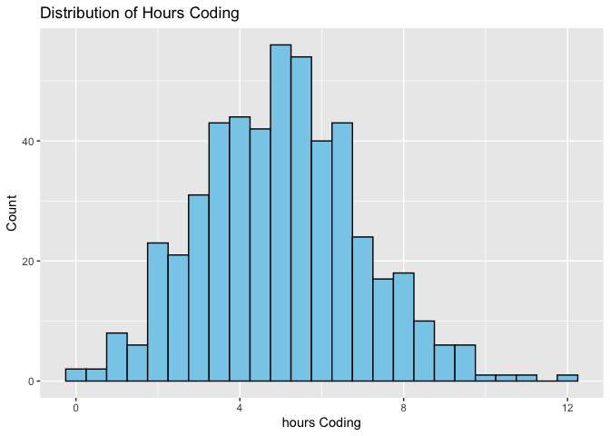
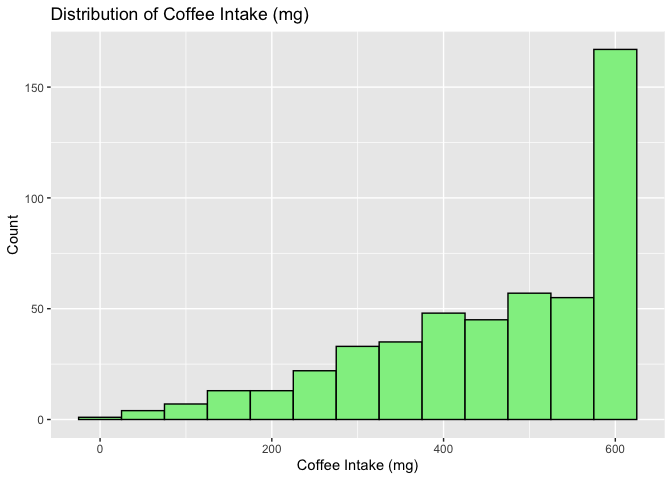
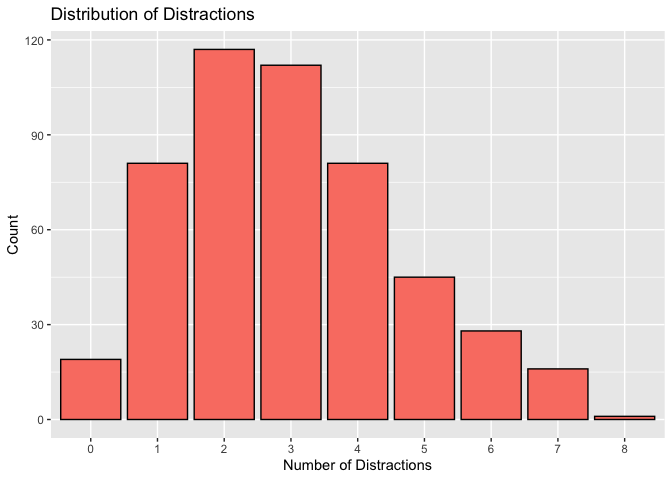
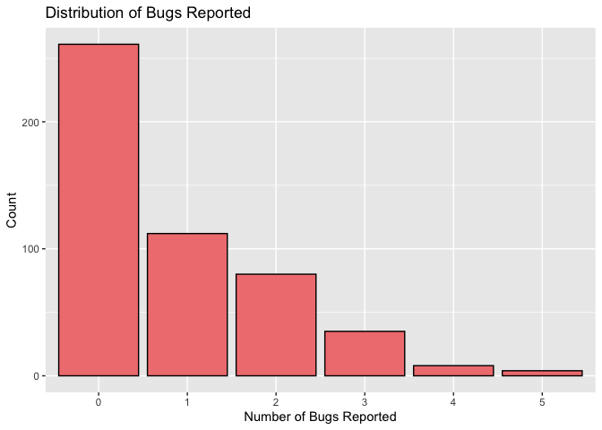
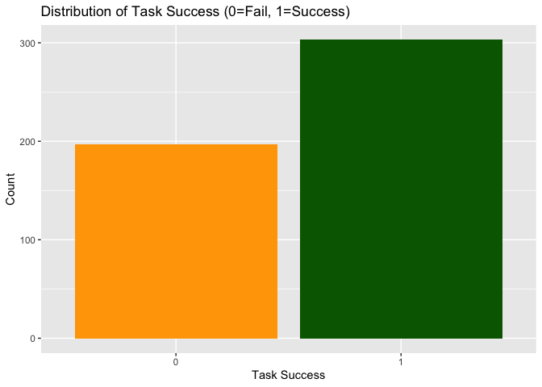
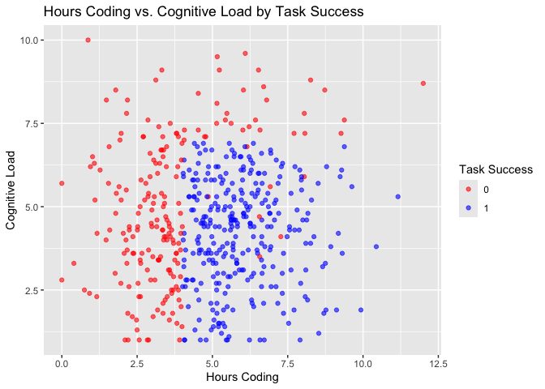
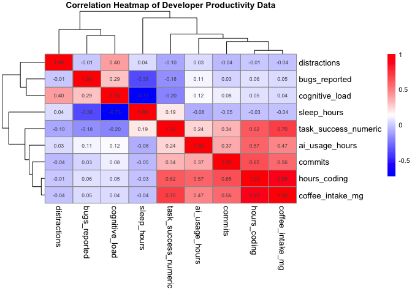
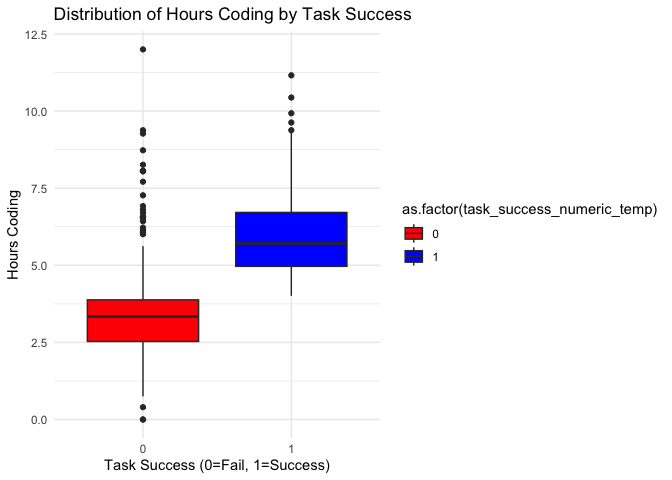

Predicting AI Developer Task Success
================
Shervairus_Morris
2025-05-23

# Introduction

Project Goal: Our primary objective in this project is to build a robust
machine learning model capable of predicting whether an AI developer’s
task will be successful (task_success = 1) or unsuccessful (task_success
= 0). This binary classification task is crucial for understanding the
factors that contribute to productivity and identifying potential areas
for intervention or improvement in a development environment.

Dataset Overview: I will be leveraging the “AI developer productivity”
dataset, which simulates various aspects of a developer’s day, including
hours_coding, coffee_intake_mg, distractions, sleep_hours, commits,
bugs_reported, and ai_usage_hours. By analyzing the interplay of these
features, we aim to uncover patterns that lead to task success.

Machine Learning Approach: This project will involve a supervised
learning (classification) approach. We will train a model on a portion
of the dataset where task_success is known, and then evaluate its
ability to predict task_success on unseen data. Our evaluation will
focus on classification metrics to assess the model’s performance.

# Data Exploratation

``` r
dev_pro<-read.csv("data/ai_dev_productivity.csv")
```

``` r
library(tidyverse)
```

    ## Warning: package 'ggplot2' was built under R version 4.3.3

    ## ── Attaching core tidyverse packages ──────────────────────── tidyverse 2.0.0 ──
    ## ✔ dplyr     1.1.4     ✔ readr     2.1.5
    ## ✔ forcats   1.0.0     ✔ stringr   1.5.1
    ## ✔ ggplot2   3.5.2     ✔ tibble    3.2.1
    ## ✔ lubridate 1.9.3     ✔ tidyr     1.3.1
    ## ✔ purrr     1.0.2     
    ## ── Conflicts ────────────────────────────────────────── tidyverse_conflicts() ──
    ## ✖ dplyr::filter() masks stats::filter()
    ## ✖ dplyr::lag()    masks stats::lag()
    ## ℹ Use the conflicted package (<http://conflicted.r-lib.org/>) to force all conflicts to become errors

``` r
head(dev_pro)
```

    ##   hours_coding coffee_intake_mg distractions sleep_hours commits bugs_reported
    ## 1         5.99              600            1         5.8       2             1
    ## 2         4.72              568            2         6.9       5             3
    ## 3         6.30              560            1         8.9       2             0
    ## 4         8.05              600            7         6.3       9             5
    ## 5         4.53              421            6         6.9       4             0
    ## 6         4.53              429            1         7.1       5             0
    ##   ai_usage_hours cognitive_load task_success
    ## 1           0.71            5.4            1
    ## 2           1.75            4.7            1
    ## 3           2.27            2.2            1
    ## 4           1.40            5.9            0
    ## 5           1.26            6.3            1
    ## 6           3.06            3.9            1

``` r
# check structure of data
str(dev_pro)
```

    ## 'data.frame':    500 obs. of  9 variables:
    ##  $ hours_coding    : num  5.99 4.72 6.3 8.05 4.53 4.53 8.16 6.53 4.06 6.09 ...
    ##  $ coffee_intake_mg: int  600 568 560 600 421 429 600 600 409 567 ...
    ##  $ distractions    : int  1 2 1 7 6 1 1 4 5 5 ...
    ##  $ sleep_hours     : num  5.8 6.9 8.9 6.3 6.9 7.1 8.3 3.6 6.1 7.3 ...
    ##  $ commits         : int  2 5 2 9 4 5 6 9 6 7 ...
    ##  $ bugs_reported   : int  1 3 0 5 0 0 0 3 2 0 ...
    ##  $ ai_usage_hours  : num  0.71 1.75 2.27 1.4 1.26 3.06 0.3 1.47 2.43 2.11 ...
    ##  $ cognitive_load  : num  5.4 4.7 2.2 5.9 6.3 3.9 2.2 9.1 7 5.1 ...
    ##  $ task_success    : int  1 1 1 0 1 1 1 0 0 1 ...

``` r
summary(dev_pro)
```

    ##   hours_coding    coffee_intake_mg  distractions    sleep_hours    
    ##  Min.   : 0.000   Min.   :  6.0    Min.   :0.000   Min.   : 3.000  
    ##  1st Qu.: 3.600   1st Qu.:369.5    1st Qu.:2.000   1st Qu.: 6.100  
    ##  Median : 5.030   Median :500.5    Median :3.000   Median : 6.950  
    ##  Mean   : 5.016   Mean   :463.2    Mean   :2.976   Mean   : 6.976  
    ##  3rd Qu.: 6.275   3rd Qu.:600.0    3rd Qu.:4.000   3rd Qu.: 7.900  
    ##  Max.   :12.000   Max.   :600.0    Max.   :8.000   Max.   :10.000  
    ##     commits       bugs_reported   ai_usage_hours   cognitive_load  
    ##  Min.   : 0.000   Min.   :0.000   Min.   :0.0000   Min.   : 1.000  
    ##  1st Qu.: 3.000   1st Qu.:0.000   1st Qu.:0.6975   1st Qu.: 3.175  
    ##  Median : 5.000   Median :0.000   Median :1.2600   Median : 4.400  
    ##  Mean   : 4.608   Mean   :0.858   Mean   :1.5109   Mean   : 4.498  
    ##  3rd Qu.: 6.000   3rd Qu.:2.000   3rd Qu.:2.0700   3rd Qu.: 5.800  
    ##  Max.   :13.000   Max.   :5.000   Max.   :6.3600   Max.   :10.000  
    ##   task_success  
    ##  Min.   :0.000  
    ##  1st Qu.:0.000  
    ##  Median :1.000  
    ##  Mean   :0.606  
    ##  3rd Qu.:1.000  
    ##  Max.   :1.000

``` r
# check for any missing/NA. values.
colSums(is.na(dev_pro))
```

    ##     hours_coding coffee_intake_mg     distractions      sleep_hours 
    ##                0                0                0                0 
    ##          commits    bugs_reported   ai_usage_hours   cognitive_load 
    ##                0                0                0                0 
    ##     task_success 
    ##                0

# Initial Findings

The dataset contains 500 observations (days/developer instances) and 9
variables.

All variables are already in numerical format (numeric or integer)

hours_coding: Ranges from 0 to 12 hours, with an average of about 5
hours. coffee_intake_mg: Varies widely from a minimum of 6mg to a
maximum of 600mg, indicating diverse caffeine habits. distractions:
Mostly low, ranging from 0 to 8, with an average around 3. sleep_hours:
Ranges from 3 to 10 hours, averaging about 7 hours. commits: From 0 to
13, with an average of 4.6 commits. bugs_reported: Ranges from 0 to 5,
with a mean of 0.86, suggesting many instances with no bugs reported.
ai_usage_hours: From 0 to 6.36 hours, averaging around 1.5 hours.
cognitive_load: A continuous measure from 1 to 10, with an average of
4.5. task_success: This is our binary target variable, with values of 0
(unsuccessful) and 1 (successful). The mean of 0.606 indicates that
approximately 60.6% of tasks were successful, suggesting a slight
imbalance towards success.

Crucially, there are no missing (NA) values in any of the columns. This
is excellent news, as it means we won’t need to perform any imputation
or complex missing data handling, simplifying our preprocessing steps
significantly.

# Data Visualization

To deepen our understanding of this dataset, let’s create some
visualizations. We’ll examine the distributions of key features and
their relationships with the target varaible task_success.

``` r
# Load necessary libraries for plotting 
library(ggplot2)

# Distribution of numerical variables

p1<-ggplot(dev_pro, aes(x= hours_coding)) + geom_histogram(binwidth = .5, fill= "skyblue", color = "black") + labs(title = "Distribution of Hours Coding ", x= "hours Coding", y= "Count") 
plot(p1)
```

<!-- -->

``` r
p2 <- ggplot(dev_pro, aes(x = coffee_intake_mg)) + geom_histogram(binwidth = 50, fill = "lightgreen", color = "black") + labs(title = "Distribution of Coffee Intake (mg)", x = "Coffee Intake (mg)", y = "Count") 
print(p2)
```

<!-- -->

``` r
# Distribution of Integer/Count Features

p3 <- ggplot(dev_pro, aes(x = as.factor(distractions))) + geom_bar(fill = "salmon", color = "black") + labs(title = "Distribution of Distractions", x = "Number of Distractions", y = "Count") 
print(p3)
```

<!-- -->

``` r
p4 <- ggplot(dev_pro, aes(x = as.factor(bugs_reported))) + geom_bar(fill = "lightcoral", color = "black") + labs(title = "Distribution of Bugs Reported", x = "Number of Bugs Reported", y = "Count") 
print(p4)
```

<!-- -->

``` r
# Class Balance of Target Variable (task_success)

p5 <- ggplot(dev_pro, aes(x = as.factor(task_success), fill = as.factor(task_success))) + geom_bar() + labs(title = "Distribution of Task Success (0=Fail, 1=Success)", x = "Task Success", y = "Count") + scale_fill_manual(values = c("0" = "orange", "1" = "darkgreen")) + theme(legend.position = "none")
print(p5)
```

<!-- -->

``` r
# Relationship between Features and Target ( scatter plots)

p6 <- ggplot(dev_pro, aes(x = hours_coding, y = cognitive_load, color = as.factor(task_success))) + geom_point(alpha = 0.6) + labs(title = "Hours Coding vs. Cognitive Load by Task Success", x = "Hours Coding", y = "Cognitive Load", color = "Task Success") + scale_color_manual(values = c("0" = "red", "1" = "blue"))
print(p6)
```

<!-- -->

``` r
p7 <- ggplot(dev_pro, aes(x = sleep_hours, y = commits, color = as.factor(task_success))) + geom_point(alpha = 0.6) + labs(title = "Sleep Hours vs. Commits by Task Success", x = "Sleep Hours", y = "Commits", color = "Task Success") + scale_color_manual(values = c("0" = "red", "1" = "blue")) 
print(p7)
```

<!-- -->

``` r
library(corrplot) # For visualizing correlation matrix
```

    ## Warning: package 'corrplot' was built under R version 4.3.3

    ## corrplot 0.94 loaded

``` r
dev_pro_cor <- dev_pro

# Ensure task_success is a factor first, then convert to numeric
if (!is.factor(dev_pro_cor$task_success)) {
  dev_pro_cor$task_success <- as.factor(dev_pro_cor$task_success)
  # Assuming 0 is Fail and 1 is Success based on previous context
  levels(dev_pro_cor$task_success) <- c('Fail', 'Success')
}
dev_pro_cor$task_success_numeric <- as.numeric(dev_pro_cor$task_success == 'Success') # Maps Success to 1, Fail to 0

# Select only numeric columns for correlation matrix 
# Keep 'task_success_numeric' and all other original numeric predictors
numeric_data <- dev_pro_cor %>%
  select(where(is.numeric), task_success_numeric) %>%
  select(-matches("task_success$"))

# 4. Calculate the correlation matrix
correlation_matrix <- cor(numeric_data, use = 'pairwise.complete.obs')

# Display the correlation matrix (numbers)
round(correlation_matrix, 2)
```

    ##                      hours_coding coffee_intake_mg distractions sleep_hours
    ## hours_coding                 1.00             0.89        -0.01       -0.03
    ## coffee_intake_mg             0.89             1.00        -0.04       -0.04
    ## distractions                -0.01            -0.04         1.00        0.04
    ## sleep_hours                 -0.03            -0.04         0.04        1.00
    ## commits                      0.65             0.56        -0.04       -0.05
    ## bugs_reported                0.06             0.05        -0.01       -0.38
    ## ai_usage_hours               0.57             0.47         0.03       -0.08
    ## cognitive_load               0.05             0.04         0.40       -0.73
    ## task_success_numeric         0.62             0.70        -0.10        0.19
    ##                      commits bugs_reported ai_usage_hours cognitive_load
    ## hours_coding            0.65          0.06           0.57           0.05
    ## coffee_intake_mg        0.56          0.05           0.47           0.04
    ## distractions           -0.04         -0.01           0.03           0.40
    ## sleep_hours            -0.05         -0.38          -0.08          -0.73
    ## commits                 1.00          0.03           0.37           0.08
    ## bugs_reported           0.03          1.00           0.11           0.29
    ## ai_usage_hours          0.37          0.11           1.00           0.12
    ## cognitive_load          0.08          0.29           0.12           1.00
    ## task_success_numeric    0.34         -0.18           0.24          -0.20
    ##                      task_success_numeric
    ## hours_coding                         0.62
    ## coffee_intake_mg                     0.70
    ## distractions                        -0.10
    ## sleep_hours                          0.19
    ## commits                              0.34
    ## bugs_reported                       -0.18
    ## ai_usage_hours                       0.24
    ## cognitive_load                      -0.20
    ## task_success_numeric                 1.00

``` r
# Load the library
library(pheatmap)

# Ensure correlation_matrix is already calculated from your previous steps
# If you are starting a new R session, you'll need to re-run the code to create 'correlation_matrix':
# library(dplyr)
# dev_pro_cor <- dev_pro
# if (!is.factor(dev_pro_cor$task_success)) {
#   dev_pro_cor$task_success <- as.factor(dev_pro_cor$task_success)
#   levels(dev_pro_cor$task_success) <- c('Fail', 'Success')
# }
# dev_pro_cor$task_success_numeric <- as.numeric(dev_pro_cor$task_success == 'Success')
# numeric_data <- dev_pro_cor %>%
#   select(where(is.numeric), task_success_numeric) %>%
#   select(-matches("task_success$"))
# correlation_matrix <- cor(numeric_data, use = 'pairwise.complete.obs')


# Create the heatmap using pheatmap
pheatmap(correlation_matrix,
         display_numbers = TRUE, # Display correlation values on the heatmap
         cluster_rows = TRUE,    # Cluster rows based on similarity
         cluster_cols = TRUE,    # Cluster columns based on similarity
         fontsize = 8,           # Adjust overall font size
         fontsize_row = 10,      # Font size for row labels
         fontsize_col = 10,      # Font size for column labels
         main = "Correlation Heatmap of Developer Productivity Data", # Title for the heatmap
         color = colorRampPalette(c("blue", "white", "red"))(100) # Custom color scale (blue for negative, red for positive)
)
```

<!-- -->

``` r
dev_pro$task_success_numeric_temp <- as.numeric(as.character(dev_pro$task_success)) # Convert back to 0/1 for clear groups

p <- ggplot(dev_pro, aes(x = as.factor(task_success_numeric_temp), y = hours_coding, fill = as.factor(task_success_numeric_temp))) +
  geom_boxplot() +
  labs(title = "Distribution of Hours Coding by Task Success",
       x = "Task Success (0=Fail, 1=Success)",
       y = "Hours Coding") +
  scale_fill_manual(values = c("0" = "red", "1" = "blue")) +
  theme_minimal()

print(p)
```

<!-- -->

# Plot Insights

p1 (Hours Coding): Mostly normal distribution, with most developers
coding 3-7 hours.

p2 (Coffee Intake): Multimodal distribution, suggesting distinct coffee
consumption habits (e.g., low, moderate, high intake).

p3 (Distractions): Highly skewed towards fewer distractions (0-2),
indicating most instances have low distraction levels.

p4 (Bugs Reported): Heavily skewed towards zero bugs reported, common
for bug data.

p5 (Task Success): Confirms class imbalance; successful tasks (1)
significantly outnumber unsuccessful tasks (0) (approx. 60% vs 40%).
This will be important for evaluation.

p6 (Hours Coding vs. Cognitive Load by Task Success): Success is often
linked to moderate coding hours and lower cognitive load; failure
appears more at higher cognitive load or extreme coding hours.

p7 (Sleep Hours vs. Commits by Task Success): Success seems to occur
across various sleep hours and commits, but failures might be associated
with very low or very high sleep hours, or very low commits.

Given the class imbalance in the target variable I will use the SMOTE
package during model creation to handle it effectively.

# Data Splitting and Traing

Now we will sample our data, create a traing and test set and use the
“SMOTE” fucntion to address the class inbalance in our dataset.

``` r
# Load necessary libraries
# install.packages("caret")
# install.packages("smotewb") # For smotewb
# install.packages("randomForest") # Will be needed for model training later

library(caret)
```

    ## Loading required package: lattice

    ## 
    ## Attaching package: 'caret'

    ## The following object is masked from 'package:purrr':
    ## 
    ##     lift

``` r
library(SMOTEWB) # Using smotewb for balancing
library(dplyr)
# Set seed for reproducibility
set.seed(123)

if (!is.factor(dev_pro$task_success)) {
  dev_pro$task_success <- as.factor(dev_pro$task_success)
  levels(dev_pro$task_success) <- c('Fail', 'Success')
}
dev_pro_model_ready <- dev_pro %>% select(-task_success_numeric_temp)

# Data Splitting
# Create an index for stratified sampling (80% train, 20% test)
trainIndex <- createDataPartition(dev_pro_model_ready$task_success, p = 0.8, list = FALSE, times = 1)

# Create training and testing sets
train_data <- dev_pro_model_ready[trainIndex, ]
test_data <- dev_pro_model_ready[-trainIndex, ]

#  Data Balancing using SMOTE-WB (on training data only) 
# Ensure 'task_success' is a factor in the training data
train_data$task_success <- as.factor(train_data$task_success)
test_data$task_success <- as.factor(test_data$task_success) # Ensure test data is also factor

# Separate features (x) and target (y) for smotewb
# All columns except 'task_success' are features
x_train <- train_data %>% select(-task_success)
y_train <- train_data$task_success

print("\nApplying SMOTE-WB to balance the training data.")
```

    ## [1] "\nApplying SMOTE-WB to balance the training data."

``` r
train_data_balanced_list <- SMOTEWB(
  x = x_train, # Feature matrix
  y = y_train  # Target variable (factor)
  # smotewb has default parameters for N and P, which aim to balance the classes.

)

# smotewb returns a list with x_new (features) and y_new (target)
train_data_balanced <- as.data.frame(train_data_balanced_list$x_new)
train_data_balanced$task_success <- train_data_balanced_list$y_new

print("\n--- Data Balancing (SMOTE-WB) Complete ---")
```

    ## [1] "\n--- Data Balancing (SMOTE-WB) Complete ---"

``` r
print("Distribution of task_success in balanced training data (train_data_balanced):")
```

    ## [1] "Distribution of task_success in balanced training data (train_data_balanced):"

``` r
print(prop.table(table(train_data_balanced$task_success)))
```

    ## 
    ##    Fail Success 
    ##     0.5     0.5

``` r
print(paste("Number of rows in balanced training data:", nrow(train_data_balanced)))
```

    ## [1] "Number of rows in balanced training data: 486"

# Logistic Regression Model

now with the training set balanced I can begin the modeling stage of the
project.

``` r
set.seed(123)

# Rename the levels of the task_success factor in both balanced training and test data
# Change 0 to "Fail" and 1 to "Success"
levels(train_data_balanced$task_success) <- c("Fail", "Success")
levels(test_data$task_success) <- c("Fail", "Success")


# Define the train control for the model. we will use five fold cross validation.
trControl<- trainControl(
  method = "cv",
  number = 5,
  verboseIter = FALSE,
  classProbs = TRUE,
  summaryFunction = twoClassSummary,
 
)

# train the model
lr_mod_cv<-train(
  task_success~., # Use all available features in the balanced training data
  data = train_data_balanced,
  method = "glm", # Specify Logistic Regression
  family = "binomial", # For binary classification
  metric = "ROC",
  trControl = trControl,
   preProcess = c("center", "scale")
)
print("\nLogistic Regression Model details and performance metrics from cross-validation:")
```

    ## [1] "\nLogistic Regression Model details and performance metrics from cross-validation:"

``` r
print(lr_mod_cv)
```

    ## Generalized Linear Model 
    ## 
    ## 486 samples
    ##   8 predictor
    ##   2 classes: 'Fail', 'Success' 
    ## 
    ## Pre-processing: centered (8), scaled (8) 
    ## Resampling: Cross-Validated (5 fold) 
    ## Summary of sample sizes: 388, 389, 389, 389, 389 
    ## Resampling results:
    ## 
    ##   ROC        Sens       Spec     
    ##   0.9562214  0.8845238  0.8641156

``` r
# Make predictions on the original (unseen) test data
# Note: caret's predict method automatically handles scaling for the test_data
# because it was specified in trControl.
predictions <- predict(lr_mod_cv, newdata = test_data)

# Predict class probabilities (useful for ROC/AUC)
probabilities <- predict(lr_mod_cv, newdata = test_data, type = "prob")

# Evaluate model performance using a Confusion Matrix
confusionMatrix_results <- confusionMatrix(
  data = predictions,
  reference = test_data$task_success,
  positive = "Success" # Specify 'Success' as the positive class
)

print("\n--- Confusion Matrix and Performance Metrics on Test Set (Logistic Regression) ---")
```

    ## [1] "\n--- Confusion Matrix and Performance Metrics on Test Set (Logistic Regression) ---"

``` r
print(confusionMatrix_results)
```

    ## Confusion Matrix and Statistics
    ## 
    ##           Reference
    ## Prediction Fail Success
    ##    Fail      34       8
    ##    Success    5      52
    ##                                           
    ##                Accuracy : 0.8687          
    ##                  95% CI : (0.7859, 0.9282)
    ##     No Information Rate : 0.6061          
    ##     P-Value [Acc > NIR] : 8.683e-09       
    ##                                           
    ##                   Kappa : 0.7287          
    ##                                           
    ##  Mcnemar's Test P-Value : 0.5791          
    ##                                           
    ##             Sensitivity : 0.8667          
    ##             Specificity : 0.8718          
    ##          Pos Pred Value : 0.9123          
    ##          Neg Pred Value : 0.8095          
    ##              Prevalence : 0.6061          
    ##          Detection Rate : 0.5253          
    ##    Detection Prevalence : 0.5758          
    ##       Balanced Accuracy : 0.8692          
    ##                                           
    ##        'Positive' Class : Success         
    ## 

``` r
print("\n--- Logistic Regression Model Coefficients (Feature Importance) ---")
```

    ## [1] "\n--- Logistic Regression Model Coefficients (Feature Importance) ---"

``` r
print(coef(lr_mod_cv$finalModel))
```

    ##      (Intercept)     hours_coding coffee_intake_mg     distractions 
    ##       -0.2160608        1.5073808        3.2459204       -0.3966251 
    ##      sleep_hours          commits    bugs_reported   ai_usage_hours 
    ##        0.6898435       -0.5497004       -0.7919714       -0.6190405 
    ##   cognitive_load 
    ##       -0.6105204

``` r
# Optionally, you can arrange them by absolute magnitude for easier comparison:
coefficients <- coef(lr_mod_cv$finalModel)
coefficients_df <- data.frame(
  Feature = names(coefficients),
  Coefficient = as.numeric(coefficients)
) %>%
  arrange(desc(abs(Coefficient))) # Arrange by absolute magnitude for importance
print("\nCoefficients ranked by absolute magnitude:")
```

    ## [1] "\nCoefficients ranked by absolute magnitude:"

``` r
print(coefficients_df)
```

    ##            Feature Coefficient
    ## 1 coffee_intake_mg   3.2459204
    ## 2     hours_coding   1.5073808
    ## 3    bugs_reported  -0.7919714
    ## 4      sleep_hours   0.6898435
    ## 5   ai_usage_hours  -0.6190405
    ## 6   cognitive_load  -0.6105204
    ## 7          commits  -0.5497004
    ## 8     distractions  -0.3966251
    ## 9      (Intercept)  -0.2160608

# Conclusion of Findings

coffee_intake_mg: Strongest Positive Impact. Higher coffee intake is
strongly associated with increased task_success.

hours_coding: Strong Positive Impact. More hours spent coding is
associated with increased task_success.

bugs_reported: Strong Negative Impact. More bugs reported is associated
with decreased task_success.

sleep_hours: Moderate Positive Impact. More sleep hours is associated
with increased task_success.

ai_usage_hours: Moderate Negative Impact. Higher AI usage hours is
associated with decreased task_success.

cognitive_load: Moderate Negative Impact. Higher cognitive load is
associated with decreased task_success.

commits: Moderate Negative Impact. More commits is associated with
decreased task_success.

distractions: Weak Negative Impact. More distractions is associated with
decreased task_success.
